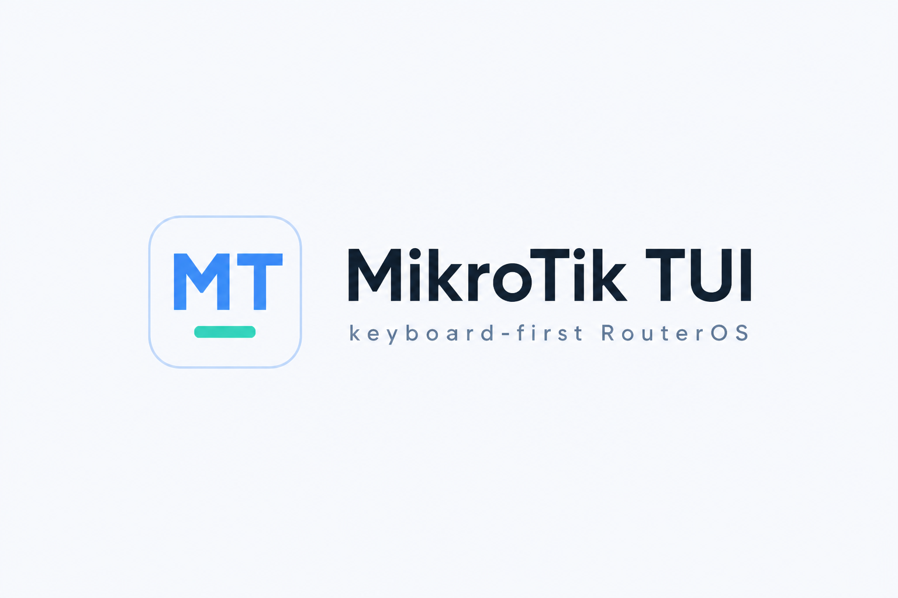

# MikroTik TUI

[](https://www.rust-lang.org/)
[](LICENSE)
[](https://github.com/hafuta/mikrotik-tui/actions/workflows/ci.yml)

> [!CAUTION]
> Tested against current RouterOS long-term. Use with caution.

<p align="center">
  
</p>

Keyboard-first terminal client for MikroTik RouterOS. It connects over
`api-ssl` (port 8729) and shows live device state: interfaces, addressing,
DHCP, firewall, hardware, and logs, without leaving the terminal.

You can create, edit, and run the usual row actions (enable/disable, copy,
remove, torch, backups) through confirmations and a properties sheet. The
same pattern covers PPP, Bridge, Switch, IP, IPv6, Routing, Queues, Files,
Tools, RADIUS, and System.

## Features

- Live dashboard for CPU, memory, WAN throughput, and firewall activity
- Tables for the common WebFig operator menus, with search, sort, and a detail pane
- Named device profiles, last-used reconnect, optional saved password, and TOTP at connect
- Demo mode (`--demo`) to learn the UI without a router
- TLS with a pinned device certificate or a custom CA
- Confirmed reboot, shutdown, and backup save/load
- Hide menus you do not use; restore them later
- In-app help (`?`) and a short description of the current screen (`i`)

RouterOS v7 with `api-ssl` enabled is required. Use a dedicated, least-privileged
account. Inspect-only access still works when you only have read permission.

## Install

macOS:

```sh
brew tap hafuta/mikrotik-tui
brew install mikrotik-tui
```

Linux (amd64 and arm64):

```sh
curl -fsSL https://raw.githubusercontent.com/hafuta/mikrotik-tui/master/scripts/install-linux.sh | sh
```

The script prefers a user-owned directory (`~/.local/bin`, then `~/bin`) so
you do not need root. On a terminal it asks where to install; pass `--yes`
to take the default, or `--prefix DIR` to pick a directory. System paths
such as `/usr/local/bin` are offered last. It asks before replacing an
existing copy.

Windows: download an archive from
[Releases](https://github.com/hafuta/mikrotik-tui/releases).

On first launch, add a device: host (`192.168.88.1` or `host:8729`), username,
and password. For a self-signed certificate, compare the SHA-256 fingerprint
before trusting it.

Apple Terminal.app before macOS 26 Tahoe does not support 24-bit color; the
app falls back to 256 colors there. iTerm2 and Terminal on Tahoe use truecolor.
Set `MIKROTIK_TUI_COLOR=truecolor` or `256` to override.

## Keyboard

Press `?` for shortcuts that apply to the current screen. The bindings below
are the ones you use constantly.

| Keys | Action |
|------|--------|
| `j` `k` or `↑` `↓` | Move |
| `h` `l` | Pan wide tables |
| `tab` / `shift+tab` | Cycle panes |
| `enter` | Open, expand, or edit |
| `/` | Filter |
| `r` | Refresh |
| `e` / `n` | Edit / add |
| `d` / `x` | Enable-disable / remove |
| `a` | Action menu |
| `ctrl+s` | Save a form |
| `ctrl+k` | Command palette |
| `?` / `i` | Help / about this screen |
| `esc` | Close overlay or clear filter |
| `q` | Quit |

Screen-specific keys (torch, ping, backups, and so on) are listed in `?` and
in the footer.

## License

This project is licensed under the [MIT License](LICENSE).
