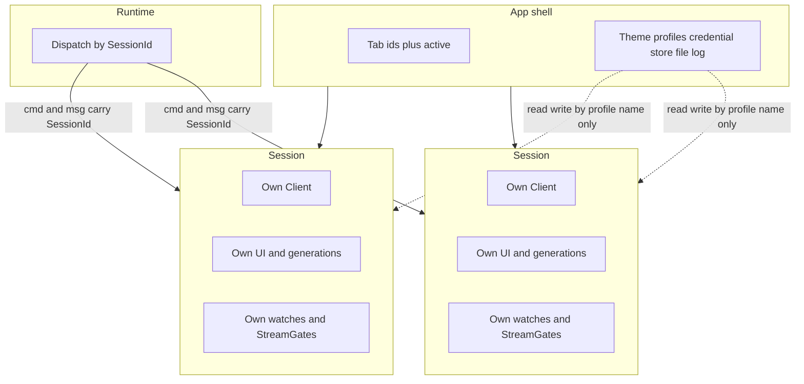

# Multi-device sessions

The TUI is one process with one paint surface. Several RouterOS devices are
modeled as isolated sessions under a thin shell, not as shared client or UI
state.

## Shell, session, runtime

- **Shell** owns the tab list, the active tab id, and process-wide stores
  (theme, saved profiles, credential store, file log). It does not own a
  RouterOS TCP session.
- **Session** owns one `Client`, one UI tree, request generations, watches,
  and `StreamGate`s. A new tab is `Session::new(id)` on Login.
- **Runtime** is the I/O loop. Every command and `WorkerMsg` carries a
  `SessionId`. Dispatch applies the message only to that session.

Chrome (`render_tab_bar` in `mtui-ui`) paints filled session tiles and a
live `●`. It does not open sockets or interpret tab ids.

## Isolation

- **Ownership.** Do not move widgets, tables, or generations between
  sessions. Closing a tab drops that session's client, watches, and gates.
- **Addressing.** Key, tick, and worker paths stamp `SessionId`. A result
  for tab A never mutates tab B.
- **Secrets.** Credentials stay at the connection boundary. Render models
  and logs do not hold passwords or TOTP.
- **I/O lifetime.** Watches and gates live with the session that started
  them. Navigation inside a session still uses that session's generation.
- **Shared stores.** Theme, profiles, credentials, and the file log are
  keyed by profile name. Sessions read and write those stores; they do not
  share in-memory maps of each other's UI.
- **New tab.** Open at Login via `Session::new(id)`. Do not clone a
  session. Cap open tabs at 8 (each connected tab uses two API sockets).

## Client handles

`Client.clone()` and `Arc<Client>` share the same two TCP sessions. Each
tab holds its own `Option<Arc<Client>>`. Clone that handle only inside the
session that connected. Two tabs never store the same `Arc`, even when they
log into the same host. Connect always opens a new pair.

## Paint vs apply

Background tabs still apply their own `WorkerMsg` so tables and generations
stay current. Only the active session is painted. Switching tabs does not
replay I/O; it selects which session `render` reads.
